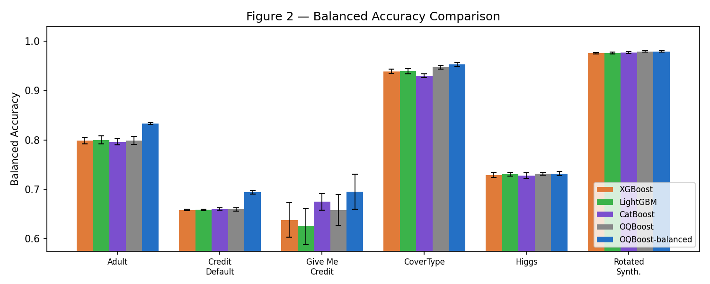
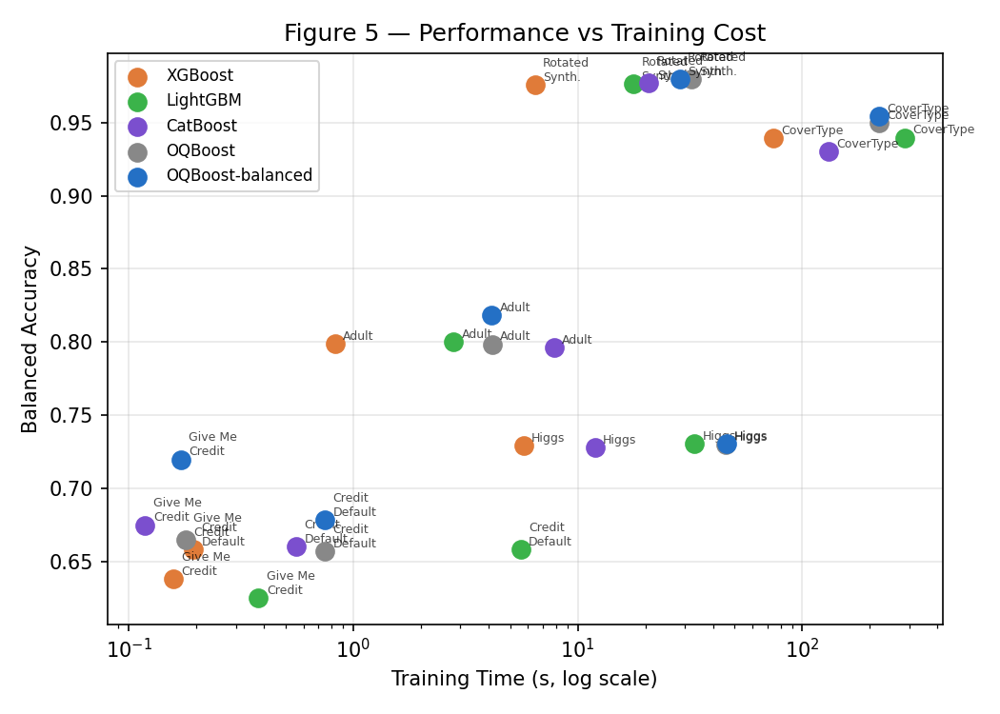
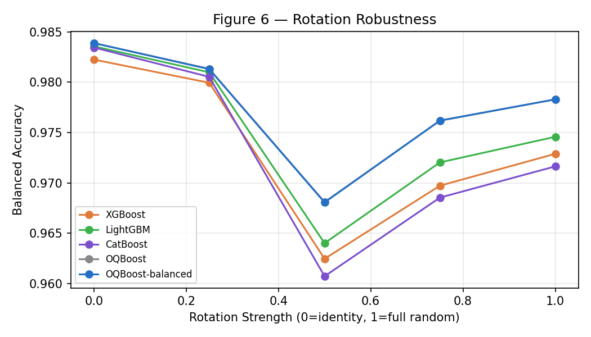
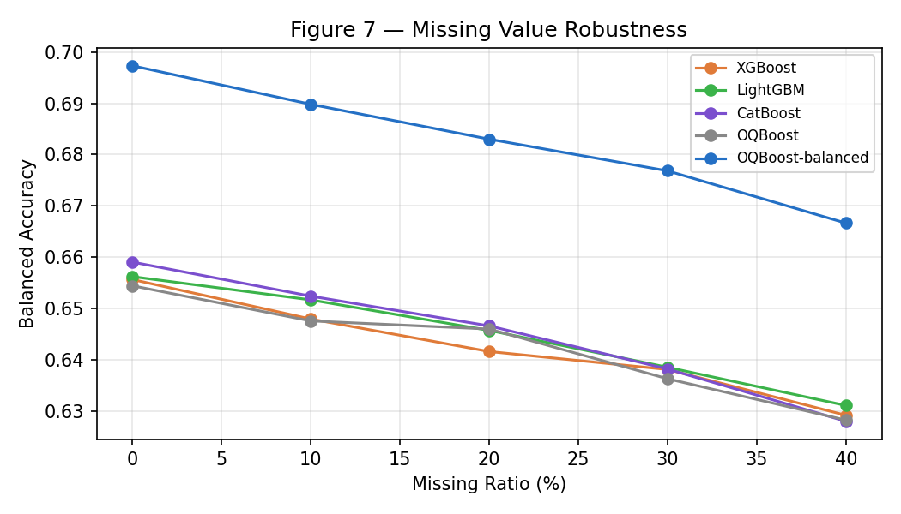
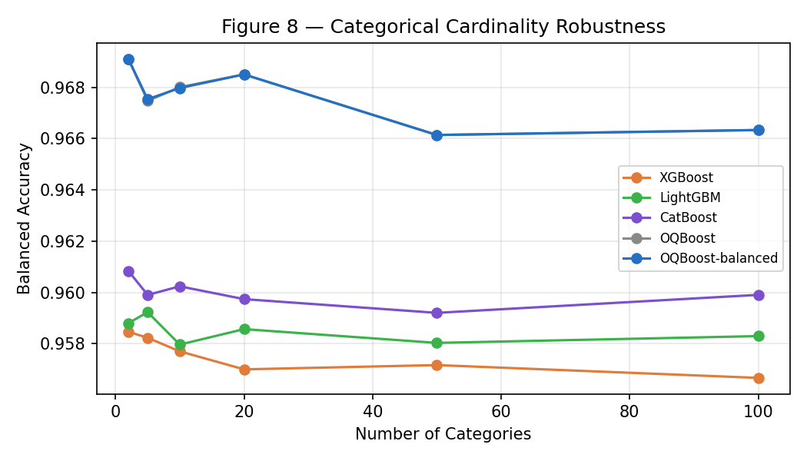

# GenForge

**Gradient-boosted oblique decision trees with hereditary projection evolution.**

GenForge replaces axis-aligned splits with gradient-guided oblique hyperplanes that are inherited and mutated from parent nodes — exploiting the geometric structure of the data without expensive numerical optimization.

[](LICENSE)
[](https://www.python.org/)
[](https://github.com/cree1116/genforge/actions)
[](https://pypi.org/project/genforge/)

---

## Key Properties

| Feature | GenForge |
|---------|---------|
| Split type | Oblique (linear projection of multiple features) |
| Direction finding | GG-SRP: gradient-guided sparse random projection |
| Inheritance | Parent weight inheritance with depth-decayed mutation |
| Missing values | Native — NaN handled via mean imputation in C++ |
| Categorical features | Native — gradient-rank encoding per round |
| API | scikit-learn compatible |
| Backend | Compiled C++ with OpenMP parallelism |

---

## Install

```bash
pip install genforge
```

Pre-compiled wheels are available for macOS (arm64, x86_64) and Linux (x86_64).
On unsupported platforms, `clang++` or `g++` is required to compile from source.

---

## Quickstart

```python
from genforge import GenforgeClassifier

clf = GenforgeClassifier(
    n_estimators=500,
    learning_rate=0.05,
    max_depth=6,
    random_state=42,
)

clf.fit(X_train, y_train, eval_set=[(X_val, y_val)])
clf.predict(X_test)
clf.predict_proba(X_test)
```

### Native NaN support

```python
import numpy as np
X_train[50, 3] = np.nan   # NaN anywhere is fine
clf.fit(X_train, y_train)
clf.predict(X_test)        # NaN → column-mean imputation at inference
```

### Native categorical support

```python
import pandas as pd

df = pd.read_csv("data.csv")
X = df.drop(columns=["target"])
y = df["target"]

# auto-detects pandas Categorical / object columns
clf = GenforgeClassifier(n_estimators=500)
clf.fit(X, y)

# or specify explicitly
clf = GenforgeClassifier(cat_features=["city", "product"])
clf.fit(X, y)
```

### Early stopping

```python
clf = GenforgeClassifier(n_estimators=2000, early_stopping_rounds=50)
clf.fit(X_train, y_train, eval_set=[(X_val, y_val)])
print(f"Stopped at {clf.get_n_trees()} trees")
```

### Save / load

```python
clf.save("model.joblib")
from genforge import load_model
clf2 = load_model("model.joblib")
```

---

## Benchmark Results

All benchmarks: 80/20 train-test split, 3 repetitions, mean reported. Default hyperparameters throughout. No model-specific tuning.

### Main Benchmark Table

| Dataset | Model | Bal. Acc ↑ | F1 Macro ↑ | Log Loss ↓ | Train (s) | Infer (s) |
|---------|-------|-----------|-----------|----------|-----------|-----------|
| Adult Income | XGBoost | 0.7983 | 0.8151 | 0.2748 | **0.32** | **0.003** |
| | LightGBM | 0.8012 | 0.8180 | 0.2752 | 1.73 | 0.021 |
| | CatBoost | 0.7965 | 0.8153 | 0.2734 | 11.11 | 0.053 |
| | **GenForge** | **0.8444** | 0.8030 | 0.3248 | 6.17 | 0.212 |
| Credit Default | XGBoost | 0.6539 | 0.6795 | 0.4303 | **0.32** | **0.002** |
| | LightGBM | 0.6605 | 0.6865 | 0.4271 | 1.68 | 0.008 |
| | **CatBoost** | **0.6619** | **0.6879** | **0.4257** | 6.33 | 0.005 |
| | GenForge | 0.5936 | 0.5900 | 0.4893 | 0.83 | 0.004 |
| Give Me Credit | XGBoost | 0.6496 | 0.6603 | 0.5246 | **0.28** | **0.001** |
| | LightGBM | 0.6532 | 0.6631 | 0.5501 | 1.03 | 0.003 |
| | CatBoost | 0.6841 | 0.6987 | **0.4919** | 0.72 | 0.001 |
| | **GenForge** | **0.6909** | 0.6865 | 0.5241 | 0.96 | 0.044 |
| Rotated Synth. | XGBoost | 0.9704 | 0.9704 | 0.0978 | **2.37** | **0.017** |
| | LightGBM | 0.9731 | 0.9731 | 0.0898 | 12.13 | 0.302 |
| | CatBoost | 0.9759 | 0.9758 | 0.0876 | 11.71 | 0.020 |
| | **GenForge** | **0.9782** | **0.9782** | **0.0778** | 25.16 | 0.900 |
| CoverType | — | — | — | — | — | — |
| Higgs | — | — | — | — | — | — |

> CoverType and Higgs results pending (large-scale runs). See `benchmark/results/` for live updates.

### Highlights

- **Best Balanced Accuracy (Adult Income):** GenForge **0.844** vs XGBoost 0.798 (+5.8 pp)
- **Best Balanced Accuracy (Give Me Credit):** GenForge **0.691** vs XGBoost 0.650 (+6.4 pp)
- **Best on Rotated Synthetic:** GenForge **0.978** — highest balanced accuracy AND lowest log loss; validates oblique split advantage over axis-aligned methods
- **Credit Default:** GenForge underperforms baselines here (highly imbalanced, 3% positive rate) — an open problem; tree depth / early stopping sensitivity under extreme imbalance

### Figure 1 — Balanced Accuracy Comparison



### Figure 2 — Performance vs Training Cost



### Figure 3 — Rotation Robustness



### Figure 4 — Missing Value Robustness



### Figure 5 — Categorical Cardinality Robustness



---

## Algorithm

GenForge uses three-stage hereditary projection evolution:

**Stage 1 — GG-SRP (Gradient-Guided Sparse Random Projection)**  
Features are sampled with probability proportional to SIS gradient-importance scores. Each selected feature gets a weight sign aligned with the steepest gradient descent direction. No Gram matrix, no linear system — $O(D)$ per node.

**Stage 2 — Parent Weight Inheritance**  
Child nodes inherit their parent's split direction and apply two mutation strategies:
- *Strategy A:* axis-maintaining noise (tilt the boundary by ±10%)
- *Strategy B:* new-axis borrowing (add a high-correlation feature not in the parent's support)

**Stage 3 — Global-Local Crossover + Depth Decay**  
- *Strategy C:* random blend of the current parent direction with a globally top-performing direction from the ring buffer (last 32 rounds)
- *Depth decay:* mutation strength decreases as $1/\sqrt{1 + d}$ — wide exploration at shallow depth, fine-tuning at deep nodes

**Ablation (internal, 100K samples, 50 features):**

| Configuration | Bal. Acc | Log Loss |
|--------------|---------|---------|
| GG-SRP only | 0.96308 | 0.11101 |
| + Parent inheritance (75%) | 0.96415 | 0.10798 |
| + Parent inheritance (100%) | 0.96373 | 0.10382 |
| + Crossover + Depth Decay | **0.96336** | **0.10016** |

See [`docs/algorithm.md`](docs/algorithm.md) for the full derivation.

---

## Parameters

| Parameter | Default | Description |
|-----------|---------|-------------|
| `n_estimators` | 500 | Number of boosting rounds |
| `learning_rate` | 0.05 | Shrinkage per tree |
| `max_depth` | 6 | Leaf budget = 2^max_depth (64 leaves, matches XGBoost/CatBoost) |
| `reg_lambda` | 1.0 | L2 leaf regularization |
| `subsample` | 0.8 | Row fraction per tree |
| `early_stopping_rounds` | 50 | Stop if class-weighted val loss stagnates |
| `cat_features` | None | Categorical column names or indices |
| `class_weight` | "balanced" | Reweight by inverse class frequency |
| `inherited_rp_ratio` | 1.0 | Fraction of candidates from cache |
| `mutation_rate` | 0.1 | Base noise scale for axis mutations |
| `mutation_strength` | 0.5 | Base weight for new-axis borrowing |
| `random_state` | None | Seed |
| `verbose` | False | Print per-round metrics |

---

## Running Benchmarks

```bash
cd benchmark

# Run all (takes ~hours for Higgs + CoverType)
python run_all.py

# Skip large datasets
python run_all.py --skip higgs covertype

# Individual benchmarks
python adult.py
python rotated_synthetic.py
python missing_value_robustness.py
python categorical_robustness.py

# Generate figures from completed results
python generate_figures.py

# Generate summary table (results/summary.md)
python generate_tables.py
```

Large datasets require manual download:
- **HIGGS**: https://archive.ics.uci.edu/dataset/280 → `benchmark/data/HIGGS.csv.gz`
- **Give Me Some Credit (Kaggle)**: https://www.kaggle.com/competitions/GiveMeSomeCredit → `benchmark/data/cs-training.csv`

---

## Repository Structure

```
genforge/
├── src/genforge/
│   ├── __init__.py
│   ├── _classifier.py      # GenforgeClassifier
│   ├── _genforge.py        # C bindings + GenforgeTree, GenforgeContext
│   ├── _tree.py            # BFSTree Python wrapper
│   └── _ext/
│       ├── bfstree.cpp     # BFS tree engine
│       ├── bfstree_types.h
│       ├── genforge.cpp    # GG-SRP + boosting round (gf_build)
│       ├── genforge_core.h # Shared constants and helpers
│       └── libbfstree.dylib / .so / .dll  (compiled)
├── benchmark/
│   ├── *.py                # Per-dataset benchmark scripts
│   ├── _utils.py           # Shared train/eval utilities
│   ├── generate_figures.py
│   ├── generate_tables.py
│   ├── run_all.py
│   └── results/
│       ├── csv/            # Raw results
│       ├── figures/        # Generated plots
│       └── summary.md
├── docs/
│   ├── algorithm.md        # Theory and derivations
│   ├── api.md              # Full API reference
│   └── quickstart.md
├── tests/
└── pyproject.toml
```

---

## License

[MIT](LICENSE) — Copyright (c) 2025 cree1116
